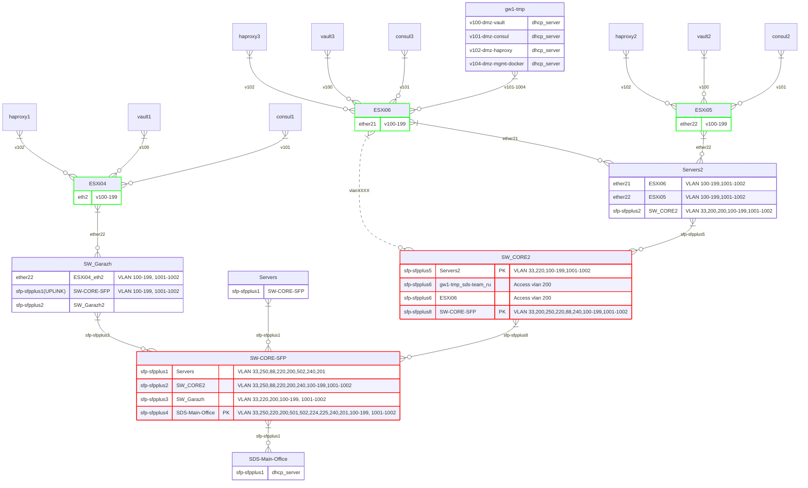

# Net diagramm

```mermaid

erDiagram
    haproxy1 }|--o{ ESXi04 : v102
    vault1 }|--o{ ESXi04 : v100
    consul1 }|--o{ ESXi04 : v101

    haproxy3 }|--o{ ESXi06 : v102
    vault3 }|--o{ ESXi06 : v100
    consul3 }|--o{ ESXi06 : v101
    gw1-tmp }|--o{ ESXi06 : v101-1004

    haproxy2 }|--o{ ESXi05 : v102
    vault2 }|--o{ ESXi05 : v100
    consul2 }|--o{ ESXi05 : v101

    gw1-tmp{
        v100-dmz-vault dhcp_server
        v101-dmz-consul dhcp_server
        v102-dmz-haproxy dhcp_server
        v104-dmz-mgmt-docker dhcp_server
    }
    
    ESXi04 :::esxi }|--o{ SW_Garazh : ether22
    ESXi04 {
        eth2 v100-199
    }

    ESXi06 :::esxi }|--o{ Servers2 : ether21
    ESXi06 :::esxi }|..o{ SW_CORE2 : vlanXXXX
    ESXi06 {
        ether21 v100-199
    }
    ESXi05 :::esxi }|--o{ Servers2 : ether22
    ESXi05 {
        ether22 v100-199
    }
    SW_Garazh }|--o{ SW-CORE-SFP:::dhcp-snooping : sfp-sfpplus3
    
    SW_Garazh {
        ether22 ESXi04_eth2 "VLAN 100-199, 1001-1002"
        sfp-sfpplus1(UPLINK) SW-CORE-SFP "VLAN 100-199, 1001-1002"
        sfp-sfpplus2 SW_Garazh2
    }

    SW-CORE-SFP {
        sfp-sfpplus1 Servers "VLAN 33,250,88,220,200,502,240,201"
        sfp-sfpplus2 SW_CORE2 "VLAN 33,250,88,220,200,240,100-199,1001-1002"
        sfp-sfpplus3 SW_Garazh "VLAN 33,220,200,100-199, 1001-1002"
        sfp-sfpplus4 SDS-Main-Office PK "VLAN 33,250,220,200,501,502,224,225,240,201,100-199, 1001-1002"
    }
    
    SW-CORE-SFP }|--o{ SDS-Main-Office : sfp-sfpplus1
    
    SDS-Main-Office {
        sfp-sfpplus1 dhcp_server
    }

    Servers }|--o{ SW-CORE-SFP : sfp-sfpplus1
    Servers {
        sfp-sfpplus1 SW-CORE-SFP
    }

    Servers2 }|--o{ SW_CORE2:::dhcp-snooping : sfp-sfpplus5
    Servers2 {
        ether21 ESXi06 "VLAN 100-199,1001-1002"
        ether22 ESXi05 "VLAN 100-199,1001-1002"
        sfp-sfpplus2 SW_CORE2 "VLAN 33,200,200,100-199,1001-1002"
    }

    SW_CORE2 }|--o{ SW-CORE-SFP : sfp-sfpplus8
    SW_CORE2 {
        sfp-sfpplus5 Servers2 PK "VLAN 33,220,100-199,1001-1002"
        sfp-sfpplus6 gw1-tmp_sds-team_ru "Access vlan 200"
        sfp-sfpplus6 ESXi06 "Access vlan 200"
        sfp-sfpplus8 SW-CORE-SFP PK "VLAN 33,200,250,220,88,240,100-199,1001-1002"

    }

    classDef dhcp-snooping stroke:#f00
    classDef esxi stroke:#0f0

```
