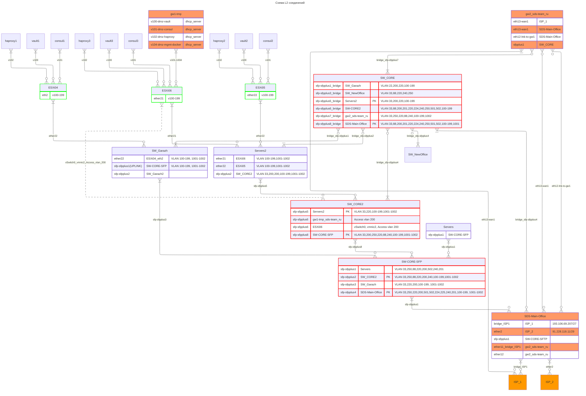

# Net diagramm

## Полезные ссылки

- [Документация](https://mermaid.js.org/syntax/entityRelationshipDiagram.html#layout)
- [Онлайн конвертер в графический формат](https://mermaid-ai-editor.com/mermaid_to_png.html)
- [Онлайн редактор](https://mermaid.live/edit#pako:eNqVVmtvmzAU_SvI-7JJENnmkYRvVdtNU59atK2aIkUITIIaHrIha5vmv8-Yp4lpskhJQJx77rnnXtvsgZ8GBLiA0KvIW1MvXiYa_2y8jKYvr0g7vBtGuteuF08RtDRX2yGIK8jOK7a5EgArgJ8mrNgqEWiZSHlMCeQc51ECpDxKBKoQ67_IyONMiTA4jzWQgyWkfSxHCZDkKBFt2bWgfXUnaHm8EcRvhuDXgo2frRihO0IlDBKYKsUoCAtQXcsoyhKoeB3nRpD6z4QeIw_VX_Xb9M91CXuJmvIWv1ffPOq9bXiFJN8QirEE75XIH-OqTjSftwl6aOeIXGhhuOVGI-jJpJJy-fDjukTvtl7yxD8SXJZSsh2raeH2SS1YQh-RYzV551droFGqNhZfH3nGsgUGS9I0i5I1T8VCfhtm2bZgZr8ZHY0icWX9Svi9BL9uL-61WopeXoiRx0vQBfayoM8_H2-_39986Qv7bxbcCcSDTvdp92oJjddNWtPUsQ312UzHGOoYQt2GWMdWeY0-UlCNwyhLydCUdKois2d5j7BmOtsYS1tcLYw7L0qMhzCMfKI93gwEdjWiqk5s8a_d1PtBroM8IZ3PzagNUkvjhaTgAXKsUaodo2aoW3g85cq0DXx0Irp4dSLc25BE2z9eTPYgWLE31LvGYPSVDZYWnn1WyMlRhfJkqZrdbgVV8CmrZwO82mu7M0UeTXz-YnGaA27FAmbkxItXtOBcF75PGBO7s8aLG41urT8vYCbVLKsubawXVbnyx1b8wFN_6zF2RUJNHiGW0_SZuJ_C9qxvcOKkaB7DEAIdrGkUADenBdFBTGjslbdAmL4EfGBisgQuvwxIWB75pYoDD8u85E-axk0kTYv1Briht2X8rsgCLyf1m1oLIUlA6GVaJDlwTduEggS4e_ACXMN08MSZmzPHmePpFPGNBLwC15o40IRTc464Q7ZtWgcdvIm0aALnU2RbU9Ox0Wxmc6cACaI8pXfVm6J4YTz8A0Dp47w)

## L2 схема сети

